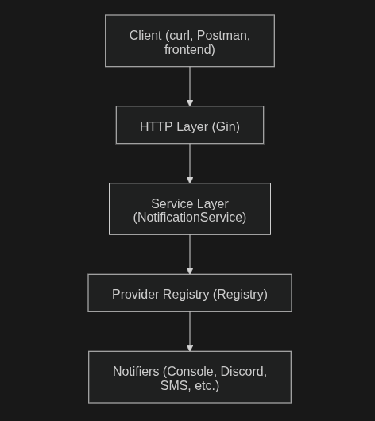

# Gopher-Alert: A Modular Notification Gateway

**Gopher-Alert** is a backend service for sending notifications to multiple providers (Console, Discord, Telegram, Slack, Email) via a single API call. Built for modularity and scalability, it showcases professional engineering practices: dependency injection, clean architecture, and UberFX lifecycle management.

---

## Table of Contents

- [Features](#features)
- [Project Structure](#project-structure)
- [Architecture](#architecture)
- [Getting Started](#getting-started)
- [API Usage](#api-usage)
- [Adding New Providers](#adding-new-providers)

---

## Features

- Modular notification system with provider interface
- UberFX for dependency injection and lifecycle management
- Gin HTTP API for sending notifications
- Supports multiple providers
- Easily extensible for future providers
- Clean separation of HTTP, service, and provider layers
- Optional API Key middleware for security

---

## Project Structure

```text
gopher-alert/
│
├── cmd/
│   └── app/
│       └── main.go
│
├── internal/
├── http/
│   ├── module.go
│   ├── server.go
│   ├── handler.go
│   ├── middleware.go
│   ├── notifier/
│   │   ├── interface.go
│   │   ├── console.go
│   │   ├── discord.go
│   │   └── registry.go
│   ├── service/
│   │   └── notification_service.go
│   ├── storage/
│   │   └── sqlite.go
│   └── config/
│       └── config.go
│
├── go.mod
└── .env
```

---

## Architecture



- **HTTP Layer:** Handles requests, validation, and middleware.
- **Service Layer:** Contains the core business logic.
- **Notifier Layer:** Abstract interface for message sending. Individual providers implement this interface.
- **Registry:** Resolves provider names to concrete notifier instances.

---

## Getting Started

### Requirements

- Go 1.21+
- Git

### Install

```bash
git clone https://github.com/puspa222/gopher-alert.git
cd gopher-alert
go mod tidy
# Run the application
go run ./cmd/app
```

---

## API Usage

### Send Notification

Send a POST request to `/v1/send` with the following JSON body:

```json
{
    "provider": "discord",
    "message": "Hello from Gopher-Alert!",
    "to":"employee",
}
```

**Headers:**
- `Content-Type: application/json`
- `X-API-Key: <your-api-key>` 

**Example using curl:**
```bash
curl -X POST http://localhost:8080/api/notify \
    -H "Content-Type: application/json" \
    -H "X-API-Key: your-api-key" \
    -d '{"provider":"discord","message":"Test message", "to":"Admin"}'
```

### Response

```json
{
    "status": "sent",
}
```

---

## Adding New Providers
To add a new provider (e.g., SMS):

1. **Create a new file** in `internal/notifier/` (e.g., `sms.go`):

    ```go
    package notifier

    import "fmt"

    // SMSNotifier implements the Notifier interface
    type SMSNotifier struct{}

    // Constructor
    func NewSMSNotifier() *SMSNotifier {
        return &SMSNotifier{}
    }

    // Send sends a message to a recipient
    func (s *SMSNotifier) Send(to string, message string) error {
        // Implement your SMS sending logic here
        fmt.Printf("[SMS] To: %s | Message: %s\n", to, message)
        return nil
    }

    // Name returns the unique name of the provider
    func (s *SMSNotifier) Name() string {
        return "sms"
    }
    ```

2. **Register your provider** in `module.go`:

    ```go
    fx.Provide(
        fx.Annotate(
            NewSMSNotifier,
            fx.As(new(Notifier)),                // Bind to interface
            fx.ResultTags(`group:"notifiers"`),  // Add to notifier group
        ),
    )
    ```

3. **No manual registry update needed:**  
   The registry automatically collects all providers in the `group:"notifiers"` group.

4. **Test your provider:**  
   Use the `/v1/send` endpoint with `"provider": "sms"` in your request body.

This approach works for any new provider—just implement the `Notifier` interface and register it as shown above.

## Contributing

Contributions are welcome! Please open issues or submit pull requests for improvements or new features.

---

## License

This project is licensed under the MIT License.